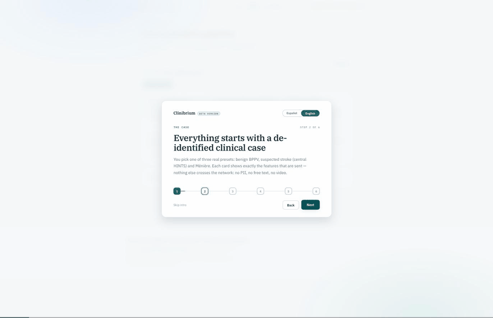
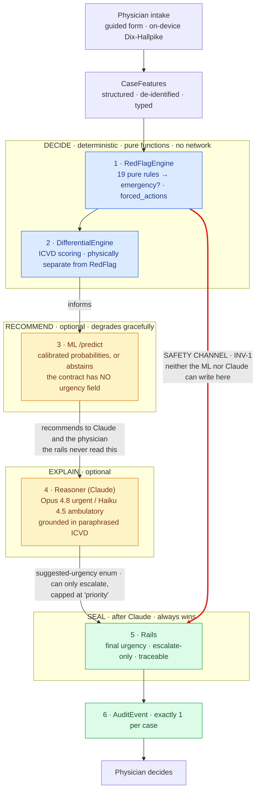
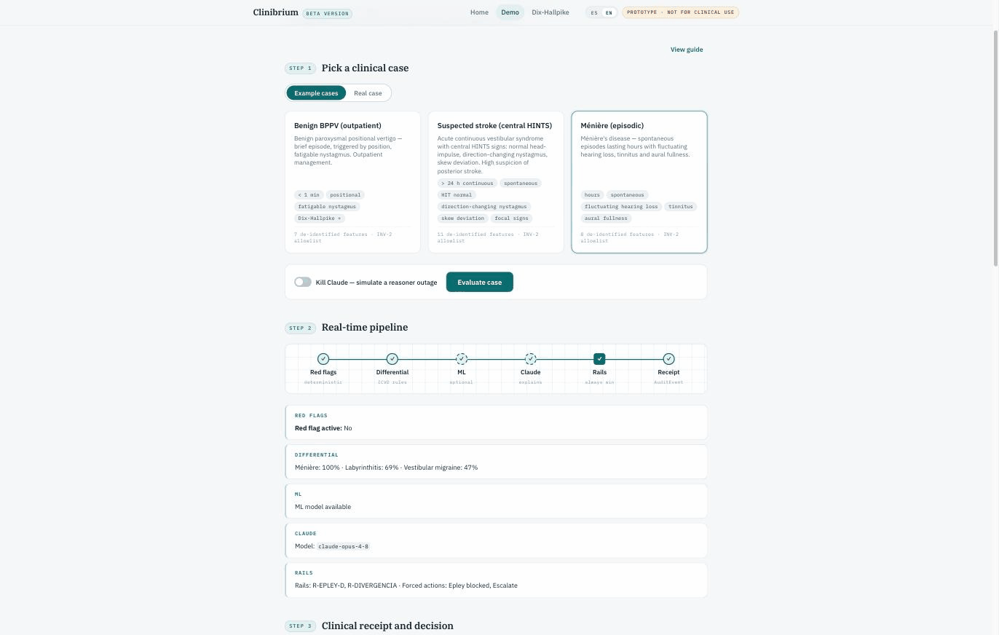
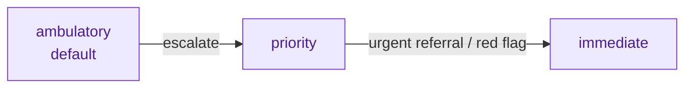
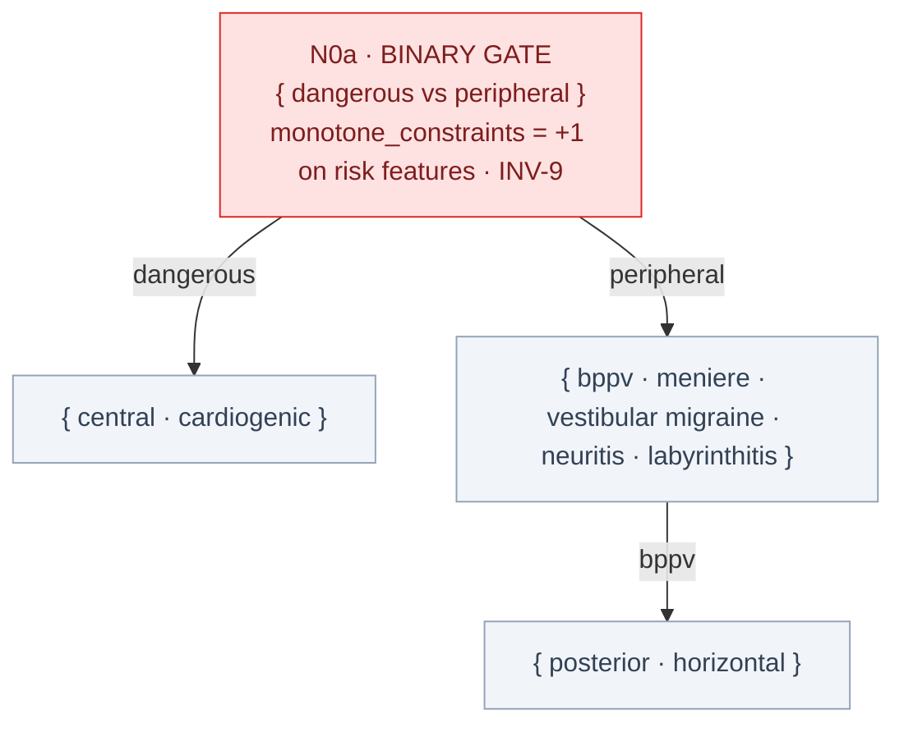
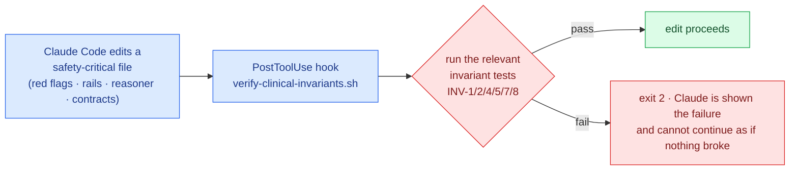
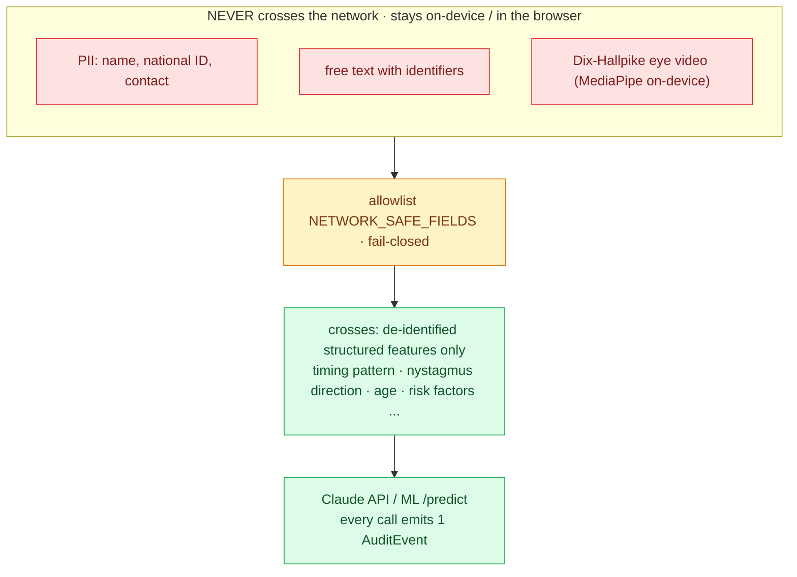
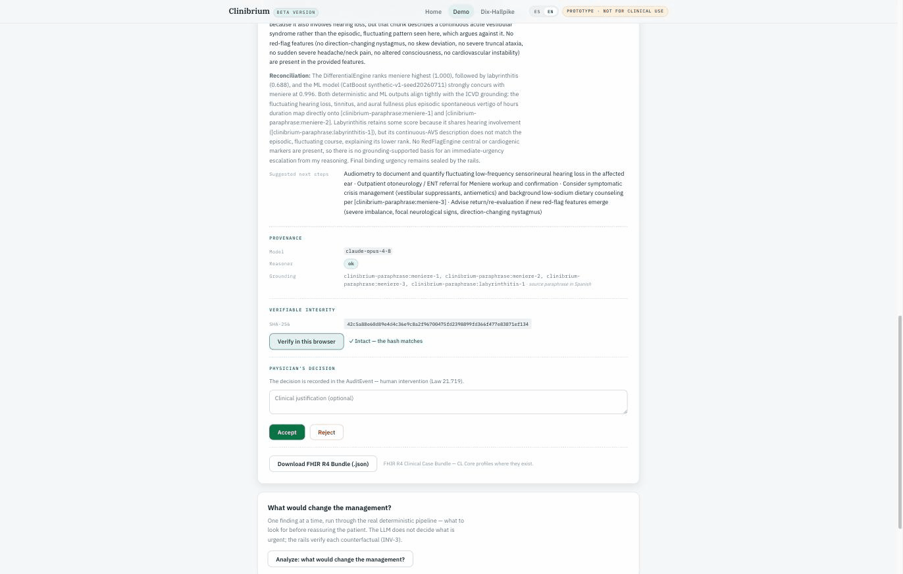

<div align="center">

# Clinibrium

### The model explains. The rails protect. The physician decides.

Clinical decision support for the otoneurology clinic, engineered so that **the model never makes the safety call.**

[](https://claude.com/claude-code)
[](LICENSE)
[](#twelve-invariants-safety-you-can-run)
[](backend)
[](frontend)
[](#the-demo-bilingual-reproducible-and-honest)

</div>

> [!IMPORTANT]
> **Research prototype. Not for clinical use.** Clinibrium is built to demonstrate a safety architecture, not to make medical decisions. The safety rails are reviewed by a subspecialist otolaryngologist; the diagnostic weights remain provisional and the system has no prospective clinical validation. See [Scope and honesty](#scope-honesty-and-roadmap).

---

<div align="center">

<br><em>A full run on a Ménière case: guided onboarding, the live evaluation pipeline streaming stage by stage, and the verifiable clinical receipt. English UI, from the public bilingual demo.</em>
</div>

## The problem

Vertigo is one of the most common reasons a patient walks into a clinic, and most of the time it is benign: a loose otolith in the inner ear, treatable in the room with a repositioning maneuver. But a small fraction of these patients are having a **posterior-circulation stroke** wearing the mask of a benign spell. The literature reports that a large share of these strokes are missed at first contact, because the bedside signs that separate them are subtle and easy to under-weight.

The error is asymmetric. Reassure a stroke patient and send them home, and you can lose them. So any software that touches this decision has to answer a harder question before it answers the clinical one:

> **What happens when the AI is wrong, or when it goes down?**

Clinibrium's answer is an architecture, not a promise.

## The idea: invert the usual LLM app

A typical LLM application puts the model in the critical path and hopes the prompt holds. Clinibrium inverts that. **Deterministic layers own everything that has to be trustworthy**, and the language model is placed exactly where a language model belongs: explaining, reconciling, and grounding, never deciding.

Three properties fall out of that inversion, and the demo proves each one live rather than asserting it:

| Property | What it means | Guaranteed by |
|---|---|---|
| **A red flag can never be overridden** | If the deterministic engine sees a stroke sign, urgency is sealed to immediate, no matter what the ML or Claude say | `RedFlagEngine` + rails (INV-1) |
| **Safety does not depend on the models** | Kill the ML or Claude mid-run and urgency, red flags, and forced actions do not change | Graceful degradation (INV-6, INV-8) |
| **The physician reviews, intervenes, and verifies** | Every evaluation emits one audit event and a receipt with a verifiable SHA-256 hash; the physician accepts or rejects, and that is recorded | Audit + FHIR (INV-4) |

The governing principle, stated once and enforced everywhere:

> The layers that must be reliable are deterministic and run without the network. The models are additive. Anything the ML or Claude contribute can only push a case toward **more** caution, never toward less.

## Architecture

Every evaluation flows through one pipeline. Read the arrows: the system **decides** twice (steps 1-2 and 5), **recommends** once (3), and **explains** once (4). The recommending and explaining layers are optional and can fail; the deciding layers are pure functions with no dependency on network, database, or external service.

The load-bearing detail is the thick red edge. The safety verdict from step 1 travels a channel that neither the ML nor Claude can write to, and arrives intact at the rails that seal the final decision.



The `RedFlagEngine` is **physically separated** from the `DifferentialEngine`: the two live in different modules that a test forbids from importing each other. "Is this an emergency?" and "which diagnosis is most likely?" are different regulatory questions, and the code keeps them apart.

<div align="center">

<br><em>The same pipeline running live. Every stage is auditable: red flags, the ICVD differential, the ML recommendation, Claude on <code>claude-opus-4-8</code>, and the rails that sealed the verdict (Epley blocked, escalate).</em>
</div>

## How it fails safely

Determinism here is not a limitation to apologize for. It is the safeguard. But Clinibrium is not *only* deterministic, and the interesting part is exactly how the reasoning layers are allowed to help without ever being allowed to harm.

### Who is allowed to decide what

Each visible decision has an owner, and the boundaries between owners are physical (a verified import graph), not conventions in a prompt.

| Layer | May | May not | Enforced by |
|---|---|---|---|
| **RedFlagEngine** | Declare an emergency, force actions | Suggest a diagnosis | INV-1, INV-5 |
| **DifferentialEngine** | Rank ICVD diagnoses with explainable scores | Set urgency, detect red flags | INV-3, INV-5 |
| **ML** | Recommend calibrated probabilities, or abstain | Set urgency (the contract has no such field), touch red flags | INV-6, INV-11 |
| **Claude (reasoner)** | Explain, reconcile, and *suggest* urgency | Set binding urgency or classification | INV-3, INV-8 |
| **Rails** | Raise urgency, block dangerous actions | Lower urgency | INV-7 |
| **Physician** | Decide | | Ley 21.719 |

### Escalate-only, by construction

Urgency lives on a three-level scale, and the rails are **monotone**: they can move a case up, never down. This is a proven property (INV-7), not a coding style.



Now trace the two reasoning layers against that scale:

- **The ML does not influence urgency at all.** The rails never read its output. Its recommendation feeds Claude's prompt and the physician's screen, and a test confirms urgency is byte-identical whether the ML is present or dead.
- **Claude can influence urgency, but only upward, only one step, and only through a rail.** If Claude's suggested-urgency enum is *higher* than the deterministic verdict, a rail (`R-DIVERGENCE`) emits a deterministic escalation that lifts the case at most to `priority`. `immediate` is unreachable from the model: that level is only ever set by a deterministic red flag or by the internal-failure fail-safe. If Claude suggests something lower or equal, it is ignored.

In one sentence: **Claude can raise the alarm, never lower it, and it can never declare the emergency by itself.** Its disagreement is a computable signal, never authority.

### Two cases through the pipeline

**A textbook benign case.** A 45-year-old with brief positional vertigo, a fatigable torsional-vertical nystagmus on Dix-Hallpike, no neurologic signs. No red-flag rule fires; the differential puts posterior BPPV on top; the ML agrees; Claude (Haiku 4.5, because the case is ambulatory) explains the ICVD criteria; the rails do not block the Epley maneuver. Result: **ambulatory, Epley permitted, physician decides.**

**The dangerous mask.** A 68-year-old, hypertensive and diabetic, with continuous vertigo for 12 hours and a *normal* head-impulse test. Rule A1 fires (a normal head impulse in an acute vestibular syndrome is paradoxically a central sign), plus A7 (age and vascular risk). `red_flag_activa = True`. Now the ML could shout "neuritis, 88%" and Claude could write a soothing paragraph, and none of it matters: the safety decision was sealed at step 1 and re-asserted at step 5. Result: **immediate, Epley blocked, urgent referral.** Claude (Opus 4.8, picked because there is a red flag) spends its turn explaining *why* a normal head impulse is the alarming finding.

That second case is the red channel in the diagram, walked end to end.

## Twelve invariants: safety you can run

Every safety claim in this repository is backed by a test that tries to break it. The full gate (`./check.sh`) runs lint, type checks, and **413 tests** (330 backend, 54 ML, 29 frontend) and is the merge condition.

| Invariant | Guarantees | Demonstrated by |
|---|---|---|
| **INV-1** | Red flag implies immediate, whatever the ML and LLM say | adversarial test (below) + end-to-end |
| **INV-2** | Only the allowlist crosses the network | injecting `patient_name` raises `PrivacyViolation` |
| **INV-3** | Binding urgency never comes from LLM text | Claude suggests `immediate`, result is `priority` |
| **INV-4** | Exactly 1 AuditEvent per invocation, always | degradation, mid-pipeline exception, and no-duplication tests |
| **INV-5** | The two engines are physically separate | AST tests over the import graph |
| **INV-6** | ML down implies identical urgency | same case with and without the ML |
| **INV-7** | Urgency never decreases | parametrized monotonicity over the scale |
| **INV-8** | Claude down implies the pipeline completes, neutrally | 5 Anthropic-client failure modes mocked |
| **INV-9** | More risk never lowers P(dangerous) | perturb each risk feature, ceteris paribus |
| **INV-10** | Abstention escalates nothing | `undetermined = 1.0` sentinel, leaves at 0 |
| **INV-11** | The ML cannot emit urgency | the serialized response contains no "urgency" field |
| **INV-12** | The ML core is domain-agnostic | a second toy domain trains and serves without touching `core/` |

The test that captures the whole philosophy is the adversarial INV-1 case. It builds a case with a real red flag, then **cheats in favor of the error**: it hands the pipeline a differential with posterior BPPV at 0.95, an ML that recommends BPPV at 95%, and a Claude that suggests `ambulatory` with the explanation "classic benign posterior BPPV." Then it asserts that the final urgency is still `immediate`, that the red-flag rail is in `applied_rails`, and that Epley is blocked.

> For Clinibrium to wrongly reassure a stroke patient, it is not enough for both of its AIs to be wrong. A test that exists precisely to prevent that would have to fail first.

## Claude, the reasoner

Claude is not a classifier here. It is the layer that turns correct-but-mute deterministic verdicts ("A1 fired, score 0.86") into grounded clinical prose, and it does three things the deterministic core cannot:

- **It reconciles the sources.** Do the rule ranking, the ML probability, and the ICVD evidence tell the same story, and where do they diverge? Claude says so.
- **It grounds every claim.** The prompt is fed paraphrased ICVD criteria (the Bárány Society classification is CC BY-NC: clinical rules are not copyrightable, their exact wording is, so Clinibrium uses its own paraphrase with stable chunk IDs). Claude must cite those IDs, so its prose is verifiable against its source, and the IDs travel into the clinical receipt.
- **It picks its own model.** `pick_model` is the single point in the system that chooses which model runs: **Opus 4.8** with adaptive thinking when there is a red flag (the urgent case earns the most capable model), **Haiku 4.5** when the case is ambulatory (latency and cost scale with risk).

Its output is **structured, not loose prose**: a typed object whose last field is a `suggested-urgency` enum, not free text. That is what lets a rail compare Claude's opinion to the deterministic verdict without ever parsing a paragraph. Two gates protect the call itself: a privacy gate that fails closed if any field outside the allowlist appears, and the model gate. Every exhausted failure degrades to `None`, and nothing about safety changes.

## The ML confidence layer

Where the rules say "meets 4 of 6 criteria," the ML says "P(posterior BPPV) = 0.87, and when I say 87% I am right about 87% of the time." It is a **calibrated confidence interface**, sensitive to feature interactions that a criteria table cannot capture, and it knows how to say "I don't know."

It mirrors the real order of triage reasoning: a monotone binary danger gate first ("is this dangerous?"), then the specific diagnosis.



Three properties matter, and all three are enforced, not hoped for:

- **It cannot set urgency (INV-11).** The response contract has no urgency field. Its two consumers are Claude's prompt and the physician's screen. The rails never read it.
- **More danger never reassures (INV-9).** Turning on a risk feature can only raise P(dangerous). This is a hard model constraint, not a prompt instruction.
- **It abstains honestly (INV-10).** Under low confidence it returns `undetermined = 1.0`, an operational sentinel, not a probability. Abstention is evidence for the reasoner and the physician; it never escalates urgency on its own.

**Trained on fully synthetic data, and it says so everywhere** (`model_version = synthetic-v1-seed20260711`). No labeled real cases were available in the project window, and using real clinical data without consent would have violated the system's own privacy contract. The reported numbers measure **recovery of a synthetic generative process, not clinical performance**, and the data and model cards state that plainly:

| Metric (synthetic recovery, not clinical) | Value |
|---|---|
| Leaf accuracy (8 classes) | 0.967 |
| Gate accuracy (danger vs peripheral) | 0.997 |
| **Danger recall** (the one that matters) | **0.988** |
| Calibrated ECE (T = 0.80) | 0.0135 |
| Abstention rate | 0.102 |
| Stress test, 40% of features missing | accuracy 0.904, abstention 0.323 |

Note the stress test behaving as it should: with 40% of the data missing, the model does not fake confidence, it abstains three times as often. The calibration and abstention machinery is built to be re-fit on real cases, which is exactly the path the data card lays out.

### A platform, not a vertigo classifier

The ML core is **domain-agnostic** and proven so by test (INV-12): a second, non-isomorphic toy domain trains and serves through the same factory by changing only its config, without touching the core. A vertigo model is what this repository ships; the layer underneath is a reusable confidence engine, and the deterministic-safety-plus-LLM-explanation pattern around it generalizes to other time-critical "benign versus emergency" decisions and other symptoms. Vertigo is the first instance, chosen because it is where the asymmetry bites hardest.

## Claude Code Safety Harness

The most creative use of Claude Code in this project is not in the product. It is in **how the product was built**, and it is a reusable pattern shipped in the public repo.

When a clinician signs off on a new safety rule, turning it into trustworthy code is the dangerous step: it is exactly where a model that "helpfully" adjusts a threshold could silently break a guarantee. The Safety Harness makes that impossible to do quietly.



Two artifacts make it work, both under `.claude/`:

- **A hook** (`hooks/verify-clinical-invariants.sh`) that fires on every edit. If the file touched is safety-critical, it reruns the matching invariant tests and returns `exit 2` on failure, so Claude sees the broken guarantee in its own transcript and stops. If the file is not safety-critical, it is a silent no-op.
- **A skill** (`skills/clinical-rail-authoring`) that guides turning a specialist-signed rule into a pure, testable predicate, with adversarial tests (positive, negative, boundary, monotonicity) mandatory, and an explicit instruction to **stop and hand the question back to the human** the moment a rule is clinically ambiguous. The skill never lets the model decide clinical content or claim validation.

> Claude turns human expertise into verifiable artifacts. The deterministic runtime makes them trustworthy. The harness makes sure the two never drift apart.

## Privacy by construction

Privacy here is a data-flow property, not a policy paragraph.



- **Ocular video is processed on-device.** The Dix-Hallpike module runs MediaPipe in the browser to track iris landmarks and derive structured nystagmus features. **Zero frames** reach the backend; only numbers leave the device. A live **Privacy Egress Meter** shows the physician, per case, how many frames were processed locally, how many were uploaded (always 0), the exact byte size and SHA-256 of the payload that crossed, and a scan of the outgoing keys for any trace of video or landmark data.
- **The network payload is an allowlist, and it fails closed.** `CaseFeatures` uses `extra="forbid"`, and the single payload builder raises `PrivacyViolation` on any field outside the allowlist rather than dropping it silently. Even the optional free-text reason a physician gives for their decision passes an anti-PII guard.
- **Every evaluation emits exactly one AuditEvent** (guaranteed by a try/finally guard), recording which engines ran, what degraded, what was decided, and a SHA-256 of the input features.
- **The clinical record is tamper-evident.** Each evaluation produces a **FHIR R4 Clinical Case Bundle** (with CL Core profiles where they exist) carrying a canonical SHA-256 hash. The receipt in the UI has a **Verify** button that recomputes the hash locally with WebCrypto and compares it to the server's, so any later alteration is detectable by anyone, without trusting the server.

This is grounded in Ley 21.719, Chile's data-protection law, which also motivates the recorded human decision at the end of the loop.

## The demo: bilingual, reproducible, and honest

The demo does not claim its three properties. It **proves** them, in front of you, with the real pipeline running:

- **The dangerous fork.** Take a benign case, change one feature (add a focal sign), and watch both branches run through the real pipeline. One variable flips the verdict to `immediate`. The rail fires for real.
- **Kill Claude.** A toggle simulates a reasoner timeout. Re-evaluate the same case: urgency, red flags, the differential, the Epley block, and the counterfactuals are identical; only the explanatory prose disappears. The receipt marks `reasoner: degraded`. Safety does not depend on the LLM, and you can see it.
- **What would change my mind.** A deterministic counterfactual engine re-runs the core over 12 single-variable perturbations and returns the minimal change that would escalate this specific case, with the exact rail that would fire. Safety-netting ("come back immediately if X appears") becomes computable output instead of a generic sentence.
- **The verifiable receipt.** A human-readable view of the artifact: urgency, rails fired, clinical inputs, rule and model versions, grounding sources, reasoner status, a verifiable SHA-256, and the physician's recorded decision. The raw FHIR R4 bundle is a secondary download.

<div align="center">

<br><em>The clinical case receipt: grounded reasoning that cites its ICVD sources, full provenance, a SHA-256 the browser re-verified as intact, and the recorded physician decision.</em>
</div>

The whole interface is **bilingual (Spanish and English)** with a hard rule: language is a *presentation* parameter, never a computation one. It travels as a query parameter, never in the request body, so it never reaches `CaseFeatures`, the ML, or the privacy allowlist. The computation and the network payloads are byte-identical in both languages, and 18 parity tests pin that. The English UI is a careful clinical and technical translation (HINTS, acute vestibular syndrome, the ICVD nomenclature), so a non-Spanish-speaking reviewer sees the same rigor a Chilean clinician does.

### Quick start

```bash
# One command: sets up venvs / model / node_modules if missing, then launches
# the ML engine (:8001) + backend (:8000, demo mode) + frontend (:3000). Ctrl-C stops all.
ANTHROPIC_API_KEY=<key> ./demo/start.sh    # the key is optional; the reasoner degrades gracefully without it
# then open http://localhost:3000/demo

# Full gate (lint + types + 413 tests):
./check.sh
```

Routes: `/` is the landing page, the pipeline demo lives at `/demo`, and the on-device Dix-Hallpike module at `/dix-hallpike`.

## Scope, honesty, and roadmap

Clinibrium is a demo grounded in Chile with reach far beyond it. Chile has on the order of 500 otolaryngologists, concentrated in a handful of urban centers. The clinician who sees the vertigo patient first, in primary care or a rural clinic, usually has no subspecialty backup and no immediate imaging, and has to make the triage call anyway. The same maldistribution holds across Latin America and much of the world, which is the point: a tool that makes the first call safer and auditable travels.

What is honest about the current state:

- **Not approved for clinical use.** The safety rails (invariant families A-E) are signed off by a subspecialist otolaryngologist (round 1). The diagnostic weights, one age-and-risk threshold, and the physician-facing messages remain provisional (round 2). There is no prospective validation, and the system is not clinically validated as a whole.
- **The ML is experimental and synthetic.** Its metrics measure recovery of a synthetic generator, not clinical accuracy, and the model never sets urgency.
- **Nystagmus tracking is experimental** (relative velocities, no validated calibration in degrees per second); torsion is confirmed by the physician, not the machine.
- **The FHIR bundle is a Clinical Case Bundle**, not a complete patient summary, and the regulatory classification is a hypothesis contingent on intended use, not a confirmed one.

The path from demo to pilot is deliberately cheap: the specialist's sign-off (T-CLIN) is the single declared blocker, and every clinical change is one table row plus one test.

**Provenance.** All code in this repository was written from scratch during Built with Claude: Life Sciences (July 7-13, 2026) using Claude Code. The clinical logic paraphrases established vestibular criteria (ICVD / Bárány Society) and the HINTS literature and draws on the team's prior otoneurology research; no prior source code was reused.

## Repository layout

```
backend/clinibrium/   engines, rails, reasoner, orchestrator, audit, storage, fhir,
                      api, grounding, ml_client, counterfactual, i18n, contracts
ml_engine/            Track B: domain-agnostic ML confidence layer (isolated package,
                      own venv, experimental / synthetic)
frontend/             Next.js: landing (/), pipeline demo (/demo), Dix-Hallpike (/dix-hallpike)
.claude/              Claude Code Safety Harness: invariant hook + rail-authoring skill
docs/CONTRACT_predict.md   frozen POST /predict contract (Track A <-> B boundary)
check.sh              CI gate (lint + types + 413 tests)
docker-compose.yml    pgvector/pgvector:pg16
```

Design records (`ARCHITECTURE.md`, append-only AD-n decisions and INV-n invariants) live alongside the code.

## License

Apache-2.0. See [LICENSE](LICENSE) (with an explicit patent grant) and [NOTICE](NOTICE) (third-party and prior-art attributions). Not for clinical use; see [Scope and honesty](#scope-honesty-and-roadmap) above.
